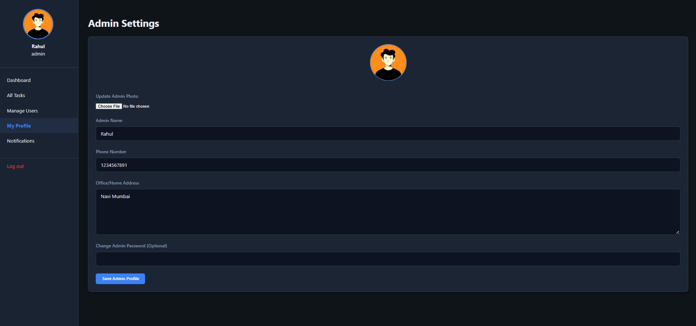
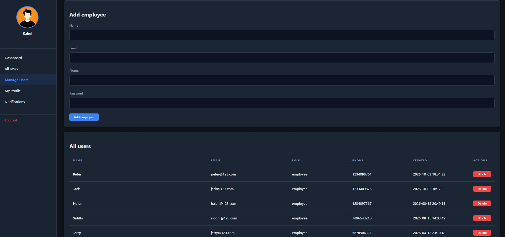
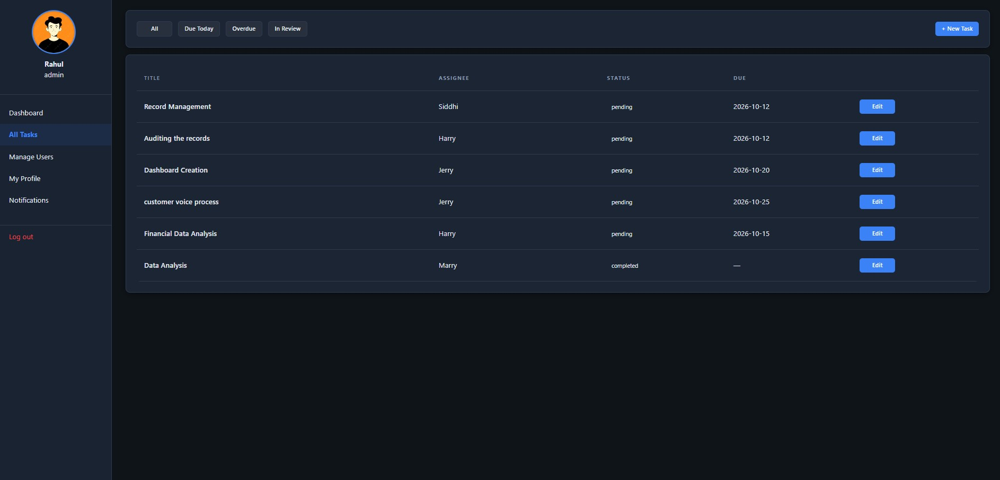
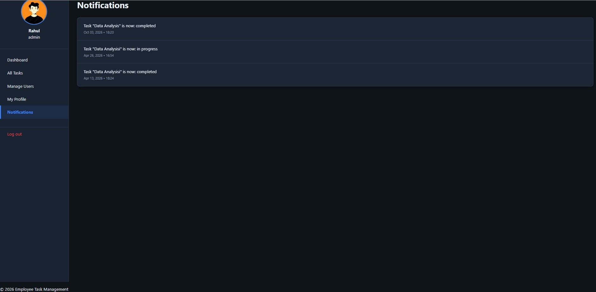
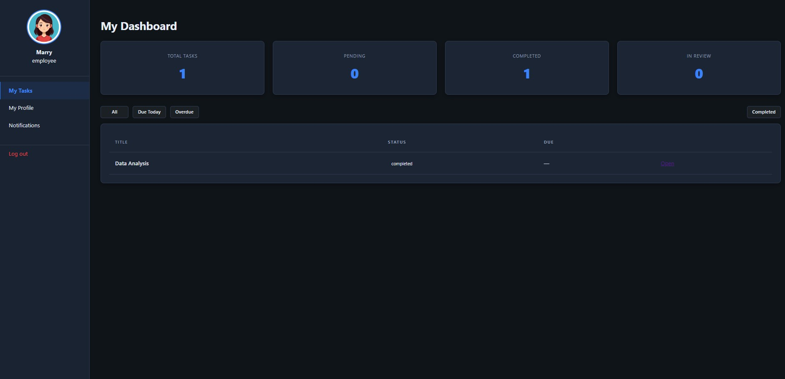
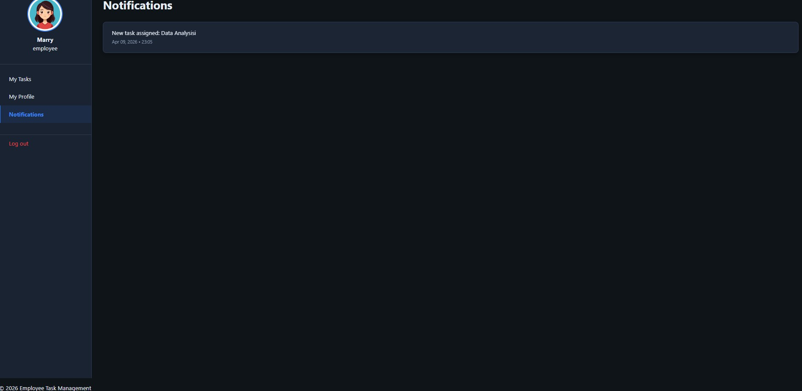
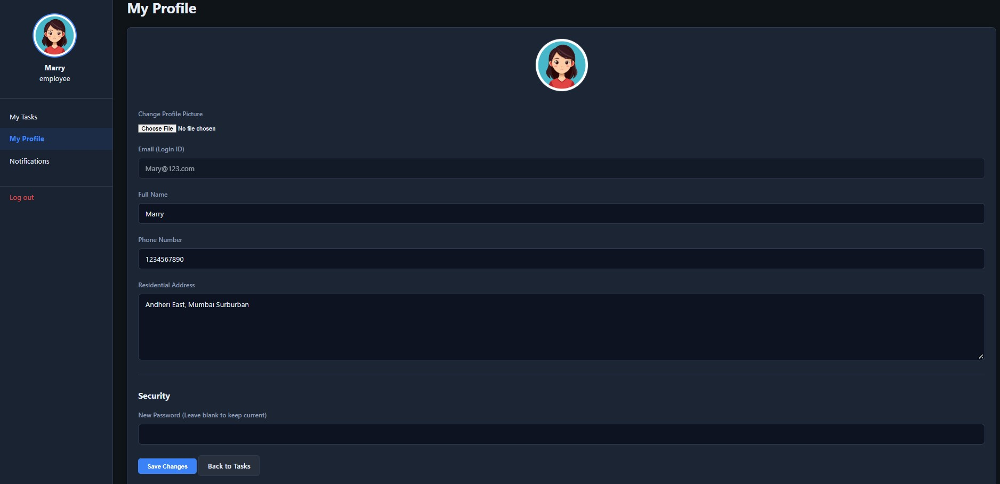
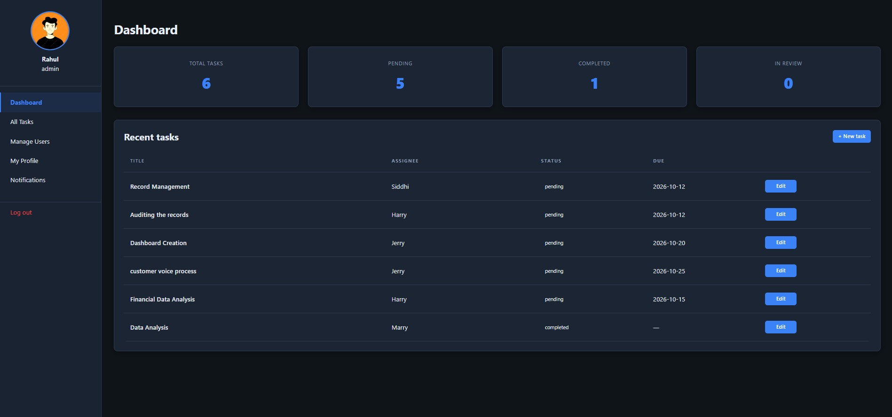
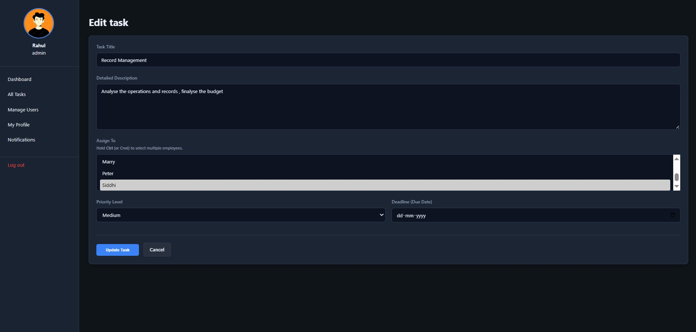

# Employee Task Management System

A web-based Employee Task Management System developed using PHP, MySQL, HTML, CSS, Bootstrap and JavaScript.

## Features

- User Login
- Admin and Employee Roles
- Admin Dashboard
- Employee Dashboard
- User Management
- Create Tasks
- Edit Tasks
- Delete Tasks
- View Tasks
- Update Task Status
- Profile Management
- Change Password
- Task Due Date
- Task Notifications
- Task Filtering

## Technologies Used

- HTML
- CSS
- Bootstrap
- JavaScript
- PHP
- MySQL
- phpMyAdmin
- XAMPP

## Project Structure

```text
Employee_Task_Management
│
├── admin
│   ├── task-form.php
│   ├── tasks.php
│   └── users.php
│
├── employee
│   ├── index.php
│   ├── profile.php
│   └── task.php
│
├── assets
│   ├── css
│   │   └── app.css
│   │
│   └── screenshots
│       ├── admin-notifications.jpg
│       ├── admin-settings.jpg
│       ├── employee-dashboard.jpg
│       ├── employee-notifications.jpg
│       ├── employee-profile.jpg
│       ├── login-page.jpg
│       ├── manage-users.jpg
│       ├── user-dashboard.jpg
│       ├── user-task-assign.jpg
│       └── user-task.jpg
│
├── includes
│   ├── auth.php
│   ├── config.php
│   ├── footer.php
│   ├── functions.php
│   ├── header.php
│   └── init.php
│
├── sql
│
├── add-user.php
├── DB_connection.php
├── index.php
├── login.php
├── logout.php
├── notifications.php
├── setup.php
└── README.md
```

## Screenshots

### Login Page


### Admin Dashboard



### Manage Users



### User Task



### Admin Notifications



### Employee Dashboard



### Employee Notifications



### Employee Profile




### User Dashboard



### User Task Assignment




## Database

The project uses MySQL as the database.

The SQL files required for the project are available in the `sql` folder.

## How to Run the Project

### 1. Install XAMPP

Install XAMPP and start:

- Apache
- MySQL

### 2. Clone or Copy the Project

Place the project inside:

```text
C:\xampp\htdocs\
```

### 3. Create the Database

Open phpMyAdmin:

```text
http://localhost/phpmyadmin/
```

Create a database named:

```text
employee_task_management
```

### 4. Import the SQL File

Import the required SQL file available in the `sql` folder into the database.

### 5. Configure Database Connection

Make sure the database connection settings match your local XAMPP configuration.

Default local configuration:

```text
Host: localhost
Username: root
Password: empty
Database: employee_task_management
```

### 6. Run the Project

Open the following URL in your browser:

```text
http://localhost/Employee_Task_Management/
```

## User Roles

### Admin

The Admin can:

- Manage users
- Create tasks
- Edit tasks
- Delete tasks
- Assign tasks
- View task status
- Manage notifications
- Manage profile

### Employee

The Employee can:

- Login to the system
- View assigned tasks
- Update task status
- View task details
- Manage profile
- Change password
- View notifications

## Task Status

The system supports different task statuses:

- Pending
- In Progress
- Completed

## Future Enhancements

- Email notifications
- Advanced reporting
- Task priority management
- Search and advanced filtering
- Role-based permissions
- Dashboard analytics

## Author

**Siddhi Bari**

GitHub: https://github.com/barisiddhi
